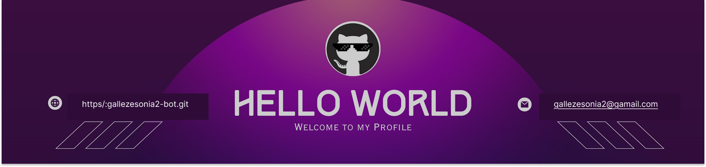

<!--Banner-->

  

<!--Header Name-->
#  ɪ'ᴍ sᴏɴɪᴀ! 
*Computer Science Student @ ESI Alger*
  

<!--Start Intro-->               

Hi, I'm Sonia — a Computer Science student at ESI Alger. I'm into web development, software engineering (logiciel), and data science / AI. I like building things end-to-end: clean interfaces on the frontend, solid architecture on the backend, and increasingly, models and pipelines that make apps smarter. Currently deepening my skills in machine learning and deep learning.

-  I’m currently learning Machine Learning and Deep Learning.
-  Interests: Web Development, Software Engineering, Data Science, Artificial Intelligence.
- ❤ Contributing to Open Source.
<!--End Intro-->

<!--Profile Count Badge-->

  

---

<!--Tech Stack Section-->
<h2 align="center">Tᴇᴄʜ Sᴛᴀᴄᴋ</h2>

<picture>
  <source media="(prefers-color-scheme: dark)" srcset="./Skills_Animation_Dark.gif">
  <source media="(prefers-color-scheme: light)" srcset="./Skills_Animation_White.gif">
  
</picture>
 

<h3 align="left">Programming Languages</h3>

  
  
  
  

<h3 align="left">Web Development</h3>

  
  
  
  
  

<h3 align="left">Data & Machine Learning</h3>

  
  
  
  
  

<h3 align="left">Tools & Systems</h3>

  
  
  
  

---

<!--Github stats Table--> 
<h2 align="center">📊 Gɪᴛʜᴜʙ Sᴛᴀᴛs 📊</h2>

<table width="100%">
  <tr>
    <td width="50%">
      <h3 align="center"><strong>Gɪᴛʜᴜʙ Sᴛᴀᴛs</strong></h3>
      

        
      

    </td>
    <td width="50%">
      <h3 align="center"><strong>Sᴛʀᴇᴀᴋ Sᴛᴀᴛs</strong></h3>
      

        
      

    </td>
  </tr>
</table>
 

<!--Contribution Graph-->
<h2 align="center">📈 Cᴏɴᴛʀɪʙᴜᴛɪᴏɴ Gʀᴀᴘʜ 📈</h2>

    

---

<!--Dynamic Quote card updates everyday at 12 PM--> 
<h2 align="center">🌟 Tʜᴏᴜɢʜᴛ ᴏғ ᴛʜᴇ Dᴀʏ 🌟</h2>

<!--STARTS_HERE_QUOTE_CARD-->

    

<!--ENDS_HERE_QUOTE_CARD-->

<!--Contact Section--> 

<h2 align="center"> Cᴏɴɴᴇᴄᴛ Wɪᴛʜ Mᴇ </h2>

   

 

<!--Footer--> 

  

